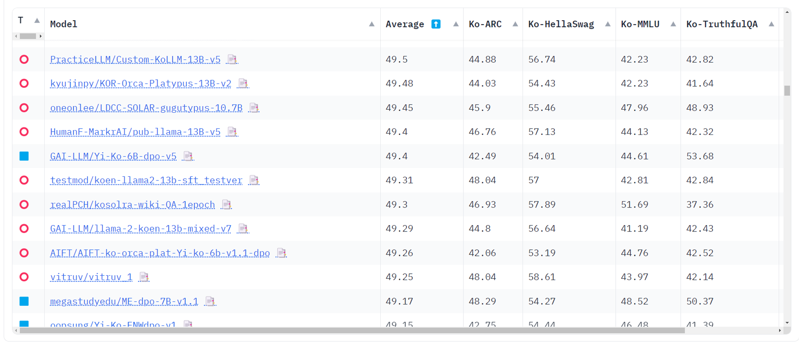

# <div align = center> Llama2 </div>

## <div align = center> Llama2 를 Finetuning 하여 자체 LLM 을 만드는 프로젝트 입니다. </div>

### UPDATE



🎉 `2024-02-25 기준 105/1073 등 달성`

### 레포 구조

```bash

+---LLama2
|   |   preprocess_data.ipynb #데이터 전처리 예시 파일
|   |   README.md
|   |   Training.ipynb #All in one 학습 노트북
|   |
|   \---src
|           dataset.py #
|           inference.py
|           main.py
|           utils.py

```

---

### TO DO LIST

`Training Part`

- [ ] DPO Training 방법 만들기
- [ ] CPU 코드에 대해 현재 Error 처리해 둔 부분 고치기

`Inference Part`

- [ ] Generation Configure 를 Json 양식으로 받기
- [ ] Training에 필요한 arg 정하기 .
- [ ] CPU inference 최적화를 추가하여 CPU Inference 기능 구현

### Setting

상위 폴더에 requirements.txt, requirements.yaml 이 존재합니다.

`pip` 를 통해 환경 설정을 할 경우

```python
conda create -n yourenv python=3.12
conda activate yourenv
pip install -r requirments.txt
```

`conda yaml` 을 통해 환경 설정을 할 경우

```python
conda env create --file environment.yaml
```

### Dataset

🚧 현재 데이터 셋 양식에 대하여 정리 중 입니다.

### Finetuning

<strong> pytorch로 직접 빌드하여 학습할 경우 </strong>

```python
python src/main.py -m '<YOUR MODEL>' -d '<YOUR DATASET>' -o '<SAVE PATH>' --train 'pytorch' --device 'gpu'
```

🌟 <strong> huggingface의 Trainer library를 사용하는 경우 </strong>

```python
python src/main.py -m '<YOUR MODEL>' -d '<YOUR DATASET>' -o '<SAVE PATH>' -peft '<DO PEFT OR NOT>' --train 'hf' --device 'gpu'
```

추가 가능한 arguments

```
'-n', '--num', type = int, default = 1, help = 'Number of epochs'
-b', '--batch', type = int, default =1, help = 'Batch size'
'-p', '--peft', type = bool, default = False, help = 'Use PEFT for training'
'--train', type = str, default = 'hf', help = 'Train method for LLM, pytorch or hf'
```

### Inference

🌟 <strong> 양자화 된 결과로 생성을 원할 경우 </strong>

```python
python src/inference.py -m '<Your MODEL PATH>' -p '<Your Prompt>' --int4 True --device 'gpu'
```

<strong> full precision (FP32)로 생성을 원하는 경우 </strong>

```python
python src/inference.py -m '<Your MODEL PATH>' -p '<Your Prompt>' --int4 False --device 'gpu'
```
